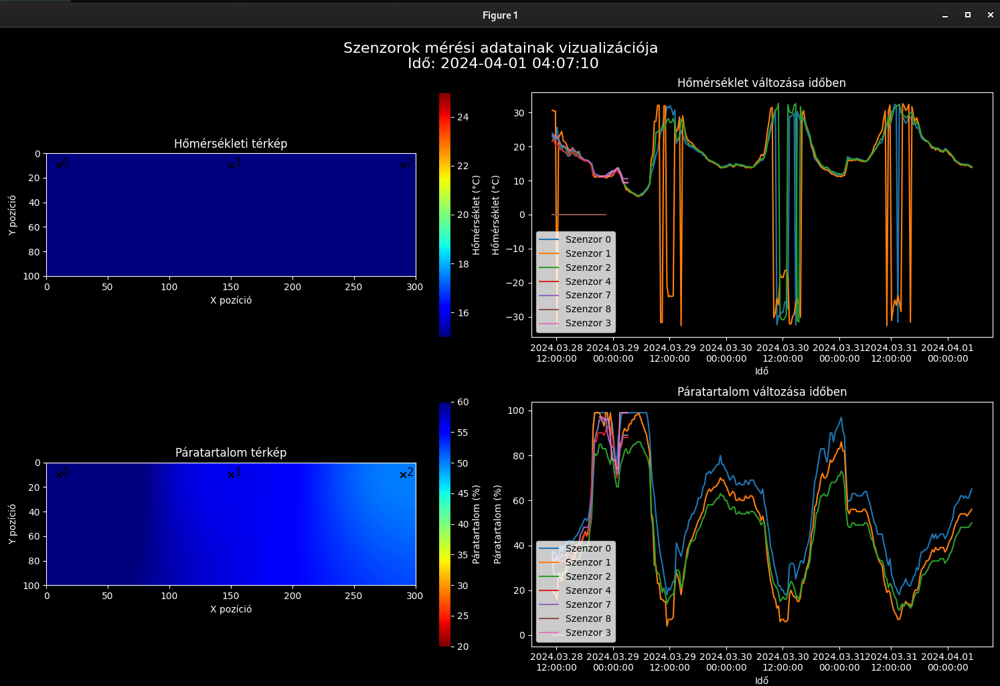

# A DHT11, fény-, páratartalom-, hőmérséklet- és porérzékelők működése
## DHT11 hőmérséklet- és páratartalom-érzékelő
A DHT11 egy népszerű hőmérséklet- és páratartalom-érzékelő, amely digitális jelkimenettel rendelkezik. Ez a szenzor egy NTC termisztort és egy kapacitív páratartalom-érzékelőt használ az adatok mérésére.

Hőmérséklet mérés:
 - A hőmérséklet méréséhez a DHT11 egy NTC (Negatív Hőmérsékleti Együtthatójú) termisztort használ. Az NTC termisztor ellenállása csökken, amikor a hőmérséklet növekszik.
 - A DHT11 belső áramköre a termisztor ellenállásának változását mérik, majd digitális jellé alakítják.

Páratartalom mérés:
 - A páratartalom méréséhez a DHT11 kapacitív páratartalom-érzékelőt használ, amely két fémlemezből áll, amelyek közötti távolságot egy nem vezető anyag (dielectric) tölti ki.
Amikor a környezeti páratartalom változik, a dielektrikum megváltoztatja a kapacitást, amit az érzékelő áramköre mér, majd ezt az értéket digitális jellé alakítja.

Fényérzékelő:
 - A fényérzékelők különböző típusai közül az egyik legismertebb a fotorezisztor (LDR, Light Dependent Resistor). Ez az érzékelő az ellenállás változásán alapul a fény intenzitásának függvényében.

### Fotorezisztor működése:

 - A fotorezisztor egy olyan ellenállás, amelynek ellenállása a rá eső fény intenzitásától függ. Sötétben az ellenállása magas, míg erős fényben jelentősen csökken.
 - Az LDR anyaga általában kadmium-szulfid (CdS), amelynek elektronikus tulajdonságai változnak a fény hatására, így változtatva az áramkörben mért ellenállást.
Porérzékelő
 - A porérzékelők, mint például a Sharp GP2Y1010AU0F, infravörös fényt használnak a levegőben lebegő por részecskék detektálására.

### Porérzékelő működése:

 - Az érzékelőben egy infravörös LED és egy fotodióda található, amelyek szögben vannak elhelyezve egymáshoz képest.
 - Amikor a levegőben lebegő por részecskék áthaladnak az érzékelőn, az infravörös fény szóródik a részecskéken, amit a fotodióda érzékel.
 - A fotodióda kimenete arányos a levegőben lévő por részecskék koncentrációjával, amit az érzékelő analóg jellé alakít.
   
Ellenállás és annak változásai
 - Az ellenállás mérése és változása kulcsfontosságú a fenti érzékelők működésében. Az ellenállás (R) a következő tényezők függvényében változik:

Hőmérséklet:
 - Az NTC termisztorok esetében az ellenállás csökken a hőmérséklet növekedésével. Ez az anyaguk sajátossága, amely alapján a hőmérsékletet mérik.
 - Az ellenállás változása exponenciális, és egy egyenlettel (Steinhart-Hart egyenlet) leírható.
 
Fényintenzitás:
 - A fotorezisztorok esetében az ellenállás csökken a fényintenzitás növekedésével. Az anyaguk, mint a kadmium-szulfid, fény hatására elektronokat szabadít fel, csökkentve az ellenállást.

Páratartalom:
 - A kapacitív páratartalom-érzékelők nem közvetlenül az ellenállást mérik, hanem a kapacitást. Azonban a kapacitás változásából a páratartalom változása kimutatható.
Porrészecskék:

A porérzékelőkben az ellenállás közvetlenül nem változik, de az infravörös fény szóródásának intenzitása alapján analóg jelet generálnak, amit feszültségként mérhetünk.

### DHT11:

Használják időjárásállomásokban, intelligens otthonokban és IoT (Internet of Things) eszközökben a hőmérséklet és páratartalom monitorozására.
Könnyen integrálható mikrovezérlőkkel, mint az Arduino vagy Raspberry Pi.

Fotorezisztorok:
 - Széles körben használják fényérzékelő áramkörökben, például utcai lámpák automatikus kapcsolásához, illetve fényintenzitás mérésére különböző elektronikai eszközökben.
 - Könnyen beépíthetők egyszerű áramkörökbe, ahol a fényintenzitás változása fontos.

Porérzékelők:
 - Alkalmazzák levegőminőség-mérő rendszerekben, légtisztítókban, és ipari környezetekben a levegő tisztaságának monitorozására.
 - Segít a beltéri levegőminőség javításában, különösen a városi környezetekben, ahol a levegő szennyezettsége magas lehet.

### Összegzés

Az érzékelők, mint a DHT11, fotorezisztorok és porérzékelők, kulcsfontosságú szerepet játszanak a környezeti paraméterek mérésében és monitorozásában. Az ellenállás változásának mérése és annak értelmezése alapvető az ilyen eszközök működésében, és lehetővé teszi számunkra, hogy pontos adatokat kapjunk a hőmérséklet, páratartalom, fényintenzitás és por koncentráció tekintetében. Ezek az érzékelők nemcsak az iparban és kutatásban hasznosak, hanem mindennapi életünk részévé váltak az intelligens otthonok és IoT eszközök terjedésével.

## Grafikus ábrázolás valós mérési adatokhoz

Volt egy csv fájl, ami minden szenzor együttes méréseit tartalmazta, az adatokat meg kellett tiszítani az alábbi módokon, hogy az érvényes mérések között kiszűrjük a jó szenzorokat:
 - "Warning" és egyébb hiteltelen sorokat érvénytelenné tenni
 - Szétválasztani az érvényes szenzorokat külön fájlokba
 - Attribútumokat szűrni, átalakítani, időzónákat lekezelni
 - Pozíciót rendelni a szenzorokhoz (ha nincs)

Ezután a main.py:
 - Az idő előrehaladtával felrajzolja a szenzorok adatait
 - Heatmap-et számol négyzetes távolsági súlyozással
 - Az adatokat egységes sémára osztja
 - Mindent logol

Néhány hibakezelés:
 - Különböző időközi és idejú szenzormérések
 - Időzóna lekezelése
 - Szenzorok elhalálozása és újraéledése
 - Epsilon segítségével a mérési idők egységessé tevése
 - Ábrázolási és számolási hibakezelések, időléptetés

Grafikus ábrázolás néhány napi (érvényesnek vett) szenzoradathoz, hogy leteszteljük, valóban nem hibásak-e a szenzorok:

